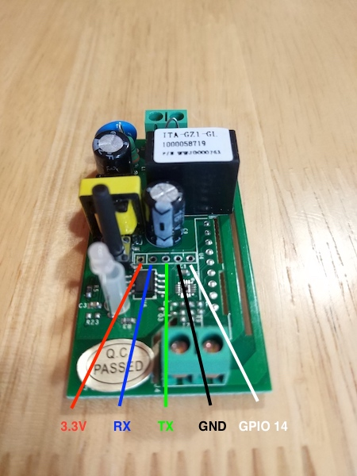

# sonoff-http
Alternative firmware for the ITEAD Sonoff Wi-Fi Remote Control Smart Switch

## Overview
This firmware is based on [Mongoose OS](https://mongoose-os.com/) and includes an embedded web server with an HTTP API
and web page for toggling the switch off and on.

## Preparing the device for flashing
1. **REMOVE POWER SOURCE FROM THE DEVICE!** Do not attempt to open the device or flash the firmware while it is connected
to a power source.
2. Open the device and remove the PCB from inside
3. Solder a 5x1 (5 GPIO model) or 4x1 (4 GPIO model) pin header to the device's GPIO.
4. Connect a 3.3V FTDI module to the pin header using the following table and image for the pin mapping. Do not use a 5V
FTDI as this could damage the ESP8266 on the device!

_Note: it is also possible to connect the FTDI to the GPIO with carefully positioned jumper cables if you prefer not to
solder the pin header. Just insert the jumper cables into the GPIO holes at an angle to ensure they maintain contact
with the copper._

| Position (from power button) | Sonoff  | FTDI |
|------------------------------|---------|------|
| 1                            | 3.3V    | VCC  |
| 2                            | RX      | TX   |
| 3                            | TX      | RX   |
| 4                            | GND     | GND  |
| 5                            | GPIO 14 |      |

## Building and flashing the firmware
1. Download and install the `mos` toolchain from
[https://mongoose-os.com/software.html](https://mongoose-os.com/software.html)
2. Build the firmware with `mos build`
3. Disconnect the FTDI so the device is off and reconnect while holding down the power button to boot into flash mode
4. Flash the firmware onto the device with `mos flash`
5. Configure Wi-Fi settings with `mos wifi <ssid> <password>` where `<ssid>` is the network SSID and `password` is the
Wi-Fi password
6. Reboot the device to take it out of flash mode
